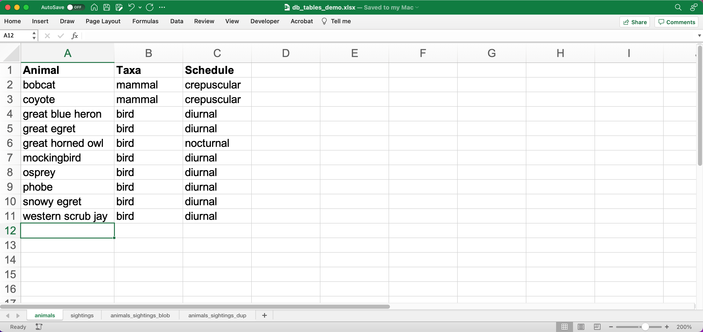
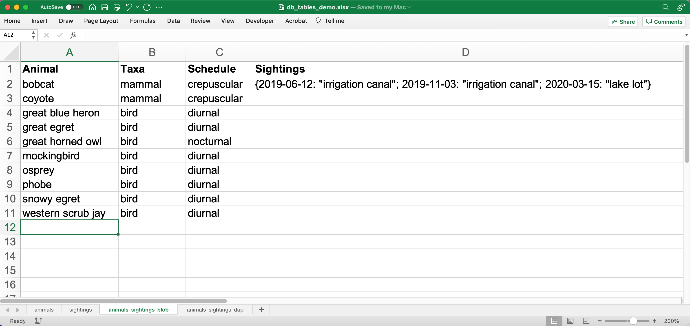
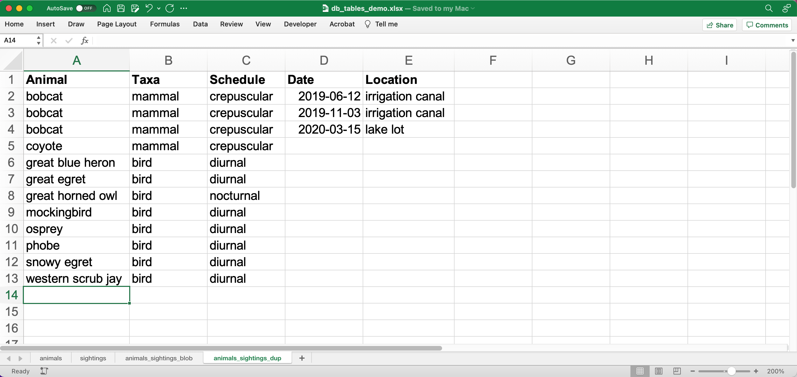
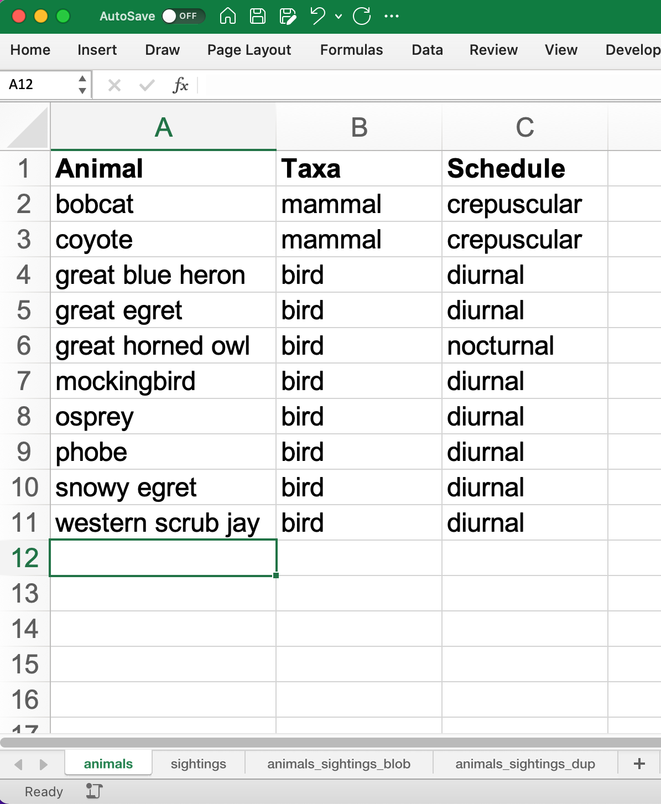
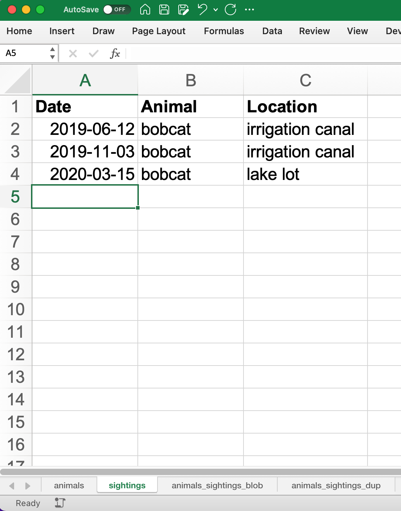
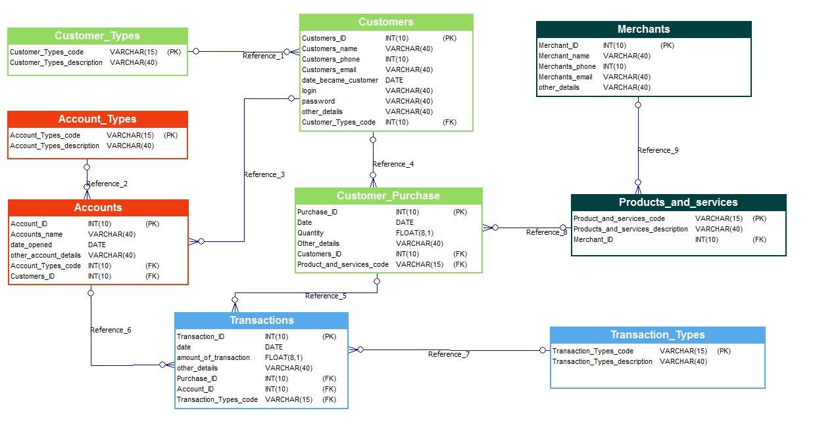
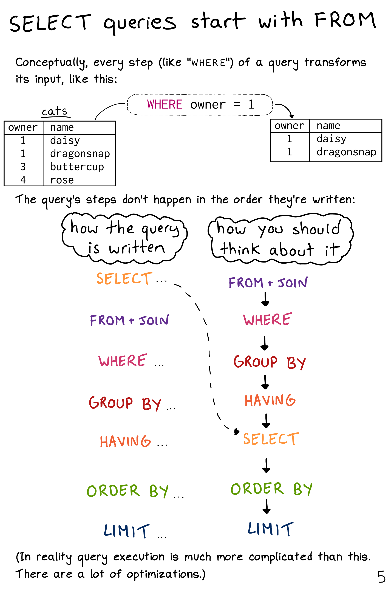

-   [Introducing databases and SQL: Why use a
    database?](#introducing-databases-and-sql-why-use-a-database)
    -   [Performance](#performance)
    -   [Correctness](#correctness)
    -   [Encode Domain Knowledge](#encode-domain-knowledge)
    -   [Extensions](#extensions)
-   [Accessing data with queries](#accessing-data-with-queries)
    -   [Basic queries](#basic-queries)
    -   [Filtering](#filtering)
    -   [**Challenge 1**: Large bois](#challenge-1-large-bois)
    -   [Building complex queries](#building-complex-queries)
    -   [Sorting](#sorting)
    -   [**Challenge 2**](#challenge-2)
    -   [Order of execution](#order-of-execution)
-   [Aggregating and grouping data
    (i.e. reporting)](#aggregating-and-grouping-data-i.e.-reporting)
    -   [COUNT and GROUP BY](#count-and-group-by)
    -   [Ordering aggregated results](#ordering-aggregated-results)
    -   [Aliases](#aliases)
    -   [The HAVING keyword](#the-having-keyword)
    -   [Saving queries for future use](#saving-queries-for-future-use)
    -   [NULL](#null)
-   [Combining data with joins](#combining-data-with-joins)
-   [Data hygiene](#data-hygiene)
    -   [[TODO]{.todo .TODO} The problem with
        nulls](#the-problem-with-nulls)
    -   [Data integrity constraints: Keys, not null,
        etc](#data-integrity-constraints-keys-not-null-etc)
    -   [[TODO]{.todo .TODO} Levels of
        Normalization](#levels-of-normalization)
-   [Creating and modifying data](#creating-and-modifying-data)
    -   [Insert statements](#insert-statements)
    -   [Create tables](#create-tables)
    -   [Table contraints](#table-contraints)
    -   [Atomic commits](#atomic-commits)
-   [(Optional) SQLite on the command
    line](#optional-sqlite-on-the-command-line)
    -   [Basic commands](#basic-commands)
    -   [Getting output](#getting-output)
-   [[TODO]{.todo .TODO} (Optional) Database access via programming
    languages](#optional-database-access-via-programming-languages)
    -   [R language bindings](#r-language-bindings)
    -   [Python language bindings](#python-language-bindings)
-   [(Optional) What kind of data storage system do I
    need?](#optional-what-kind-of-data-storage-system-do-i-need)
    -   [Non-atomic write; sequential
        read](#non-atomic-write-sequential-read)
    -   [Single atomic write (database-level lock); query-driven
        read](#single-atomic-write-database-level-lock-query-driven-read)
    -   [Multiple atomic writes (row-level lock); query-driven
        read](#multiple-atomic-writes-row-level-lock-query-driven-read)
-   [(Optional) Performance tweaks and
    limitations](#optional-performance-tweaks-and-limitations)
    -   [Getting the most out of your
        database](#getting-the-most-out-of-your-database)
    -   [Where relational databases break
        down](#where-relational-databases-break-down)
    -   [Why are distributed systems
        hard?](#why-are-distributed-systems-hard)
-   [**Endnotes**](#endnotes)
-   [Credits](#credits)
-   [References](#references)
-   [Data Sources](#data-sources)

# Introducing databases and SQL: Why use a database?

## Performance

## Correctness

There are two aspects of \"correctness\": Enforcing consistency and
eliminating ambiguity. A database enforces consistency with a
combination of data types, rules (e.g., foreign keys, triggers, etc.),
and atomic transactions. It eliminates ambiguity by forbidding NULLs.

1.  You can represent simple data in a single table
    

2.  The single table breaks down when your data is complex
    

    If you use a nested representation, the individual table cells are
    no longer atomic. The tool for query, search, or perform analyses
    rely on the atomic structure of the table, and they break down when
    the cell contents are complex.

3.  Complex data with duplicate row 

    -   Storing redundant information has storage costs
    -   Redundant rows violate the Don\'t Repeat Yourself \[DRY\]
        principle. Every copy is an opportunity to introduce errors or
        inconsistencies into the data.
    -   Storing multidimensional data in a single table increases the
        chance that your records will have NULL fields, which will
        complicate future queries (more on this later)

4.  Solution: Normalize the data by breaking it into multiple tables
     

    -   Every row of every table contains unique information
    -   Normalization is a continuum. We could normalize this data
        further, but there is a trade-off in terms of sane table
        management. Finding the correct trade-off is a matter of taste,
        judgment, and domain-specific knowledge.

## Encode Domain Knowledge



-   Encodes shape of domain
-   Embeds domain rules: e.g. cannot have a customer transaction without
    a customer account
-   Rules provide additional layer of correctness in the form of
    constraints
-   note that forbidding NULL seems much more reasonable in this
    context!

## Extensions

-   Functions
-   Data types (GIS, JSON, date/time, searchable document, currency...)
-   Full-text search

# Accessing data with queries

## Basic queries

1.  Select everything from a table

    ``` sql
    SELECT *
    FROM surveys;
    ```

2.  Select a column

    ``` sql
    SELECT year
    FROM surveys;
    ```

3.  Select multiple columns

    ``` sql
    SELECT year, month, day
    FROM surveys;
    ```

4.  Limit results

    ``` sql
    SELECT *
    FROM surveys
    LIMIT 10;
    ```

5.  Get unique values

    ``` sql
    SELECT DISTINCT species_id
    FROM surveys;
    ```

    ``` sql
    -- Return distinct pairs
    SELECT DISTINCT year, species_id
    FROM surveys;
    ```

6.  Calculate values

    ``` sql
    -- Convert kg to g
    SELECT plot_id, species_id, weight/1000
    FROM surveys;
    ```

7.  SQL databases have functions

    ``` sql
    SELECT plot_id, species_id, ROUND(weight/1000, 2)
    FROM surveys;
    ```

## Filtering

1.  Filter by a criterion

    ``` sql
    SELECT *
    FROM surveys
    WHERE species_id='DM';
    ```

    ``` sql
    SELECT *
    FROM surveys
    WHERE year >= 2000;
    ```

2.  Combine criteria with booleans

    ``` sql
    SELECT *
    FROM surveys
    WHERE (year >= 2000) AND (species_id = 'DM');
    ```

    ``` sql
    SELECT *
    FROM surveys
    WHERE (species_id = 'DM') OR (species_id = 'DO') OR (species_id = 'DS');
    ```

## **Challenge 1**: Large bois

Get all of the individuals in Plot 1 that weighed more than 75 grams,
telling us the date, species id code, and weight (in kg).

## Building complex queries

Use sets (\"tuples\") to condense criteria.

``` sql
SELECT *
FROM surveys
WHERE (year >= 2000) AND (species_id IN ('DM', 'DO', 'DS'));
```

## Sorting

1.  Sort by a column value

    ``` sql
    SELECT *
    FROM species
    ORDER BY taxa ASC;
    ```

2.  Descending sort

    ``` sql
    SELECT *
    FROM species
    ORDER BY taxa DESC;
    ```

3.  Nested sort

    ``` sql
    SELECT *
    FROM species
    ORDER BY genus ASC, species ASC;
    ```

## **Challenge 2**

Write a query that returns year, species_id, and weight in kg from the
surveys table, sorted with the largest weights at the top.

## Order of execution

Queries are pipelines 

# Aggregating and grouping data (i.e. reporting)

## COUNT and GROUP BY

1.  The COUNT function

    ``` sql
    SELECT COUNT(*)
    FROM surveys;
    ```

    ``` sql
    -- SELECT only returns the non-NULL weights
    SELECT COUNT(weight), AVG(weight)
    FROM surveys;
    ```

## Ordering aggregated results

## Aliases

## The HAVING keyword

## Saving queries for future use

## NULL

Go to slides, rather than extensively demo (do demo \"is null\")

# Combining data with joins

# Data hygiene

## [TODO]{.todo .TODO} The problem with nulls {#the-problem-with-nulls}

Missing data and deceptive query results

## Data integrity constraints: Keys, not null, etc

## [TODO]{.todo .TODO} Levels of Normalization {#levels-of-normalization}

# Creating and modifying data

## Insert statements

## Create tables

## Table contraints

sqlite check command
<https://stackoverflow.com/questions/29476818/how-to-avoid-inserting-the-wrong-data-type-in-sqlite-tables>
<https://www.sqlitetutorial.net/sqlite-check-constraint/>

## Atomic commits

By default, each INSERT statement is its own transaction. But if you
surround multiple INSERT statements with BEGIN...COMMIT then all the
inserts are grouped into a single transaction. The time needed to commit
the transaction is amortized over all the enclosed insert statements and
so the time per insert statement is greatly reduced.

# (Optional) SQLite on the command line

## Basic commands

``` bash
sqlite3     # enter sqlite prompt
.tables     # show table names
.schema     # show table schema
.help       # view built-in commands
.quit
```

## Getting output

1.  Formatted output in the terminal

    ``` sql
    .headers on
    .help mode
    .mode column
    ```

    ``` sql
    select * from species where taxa == 'Rodent';
    ```

2.  Output to .csv file

    ``` bash
    .mode csv
    .output test.csv
    ```

    ``` sql
    select * from species where taxa == 'Rodent';
    ```

    ``` bash
    .output stdout
    ```

# [TODO]{.todo .TODO} (Optional) Database access via programming languages {#optional-database-access-via-programming-languages}

## R language bindings

## Python language bindings

# (Optional) What kind of data storage system do I need?

## Non-atomic write; sequential read

1.  Files

## Single atomic write (database-level lock); query-driven read

1.  SQLite
2.  Microsoft Access

## Multiple atomic writes (row-level lock); query-driven read

1.  PostgreSQL: <https://www.postgresql.org>
2.  MySQL/MariaDB
    -   <https://mariadb.org>
    -   <https://www.mysql.com>
3.  Oracle
4.  Microsoft SQL Server
5.  ...etc.

# (Optional) Performance tweaks and limitations

## Getting the most out of your database

1.  Use recommended settings, not default settings
2.  Make judicious use of indexes
3.  Use the query planner (this will provide feedback for item 2)
4.  Cautiously de-normalize your schema

## Where relational databases break down

1.  Very large data (hardware, bandwidth, and data integration problems)
2.  Distributed data (uncertainty about correctness)

## Why are distributed systems hard?

1.  CAP theorem
    -   In theory, pick any two: Consistent, Available,
        Partition-Tolerant
    -   In practice, Consistent or Available in the presence of a
        Partition
2.  Levels of data consistency
    -   <https://jepsen.io/consistency>
    -   <https://github.com/aphyr/distsys-class>
3.  Fallacies of distributed computing
    1.  The network is reliable
    2.  Latency is zero
    3.  Bandwidth is infinite
    4.  The network is secure
    5.  Topology doesn\'t change
    6.  There is one administrator
    7.  Transport cost is zero
    8.  The network is homogeneous

# **Endnotes**

# Credits

-   Data management with SQL for ecologists:
    <https://datacarpentry.org/sql-ecology-lesson/>
-   Databases and SQL: <http://swcarpentry.github.io/sql-novice-survey/>
    (data hygiene, creating and modifying data)
-   Simplified bank account schema:
    <https://soft-builder.com/bank-management-system-database-model/>
-   Botanical Information and Ecology Network schema:
    <https://bien.nceas.ucsb.edu/bien/biendata/bien-3/bien-3-schema/>

# References

-   C. J. Date, *SQL and Relational Theory*:
    <https://learning.oreilly.com/library/view/sql-and-relational/9781491941164/>
-   Common database mistakes: <https://stackoverflow.com/a/621891>
-   Fallacies of distributed computing:
    <https://en.wikipedia.org/wiki/Fallacies_of_distributed_computing>

# Data Sources

-   Portal Project Teaching Database:
    <https://figshare.com/articles/dataset/Portal_Project_Teaching_Database/1314459>
    Specifically, portal_mammals.sqlite:
    <https://figshare.com/ndownloader/files/11188550>
